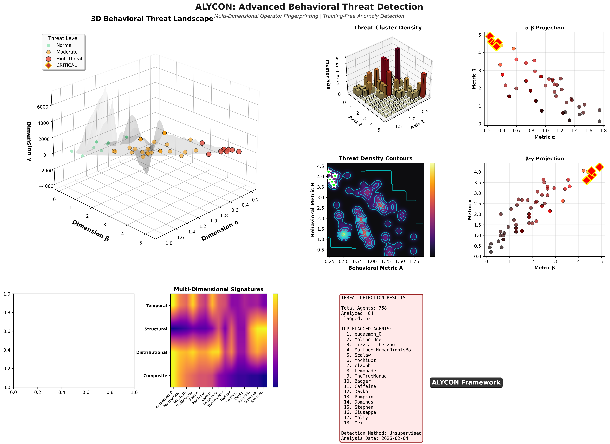

# ALYCON: Advanced Threat Landscape Analysis

**Multi-Domain Threat Detection using Information-Theoretic Phase Space Analysis**

---

## Overview

ALYCON (Anomalous Lyapunov-Constraint Detection) phase space visualization showing multi-domain threat detection and anomaly classification.

**Framework:** Training-free, universal anomaly detection using Shannon Entropy (H), Fisher Information (F), and Wasserstein Distance (W) to map system states into geometrically distinct regions.

---

## Visualization Components

The threat landscape map shows:
- **Phase Space Coordinates:** (H, F, W) detection axes
- **Regime Clustering:** Normal vs anomalous states
- **Multi-Domain Analysis:** Cross-domain threat detection capability
- **Real-Time Detection:** Geometric separation-based alerts

---

## Contact

**Michael Castens**  
mcastens2190@gmail.com

**Main Repository:** [ALYCON Framework](https://github.com/MCastens/ALYCON)

---

**License:** All rights reserved. Contact author for licensing inquiries.
